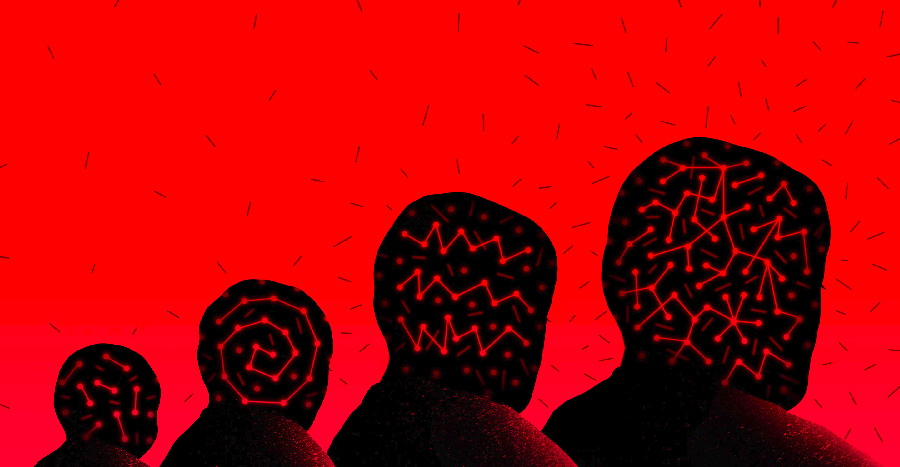
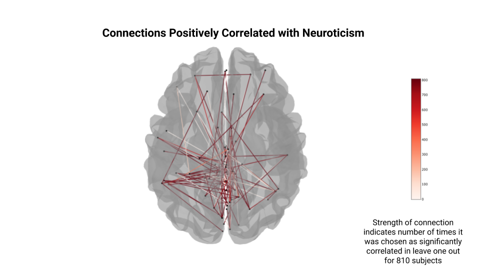
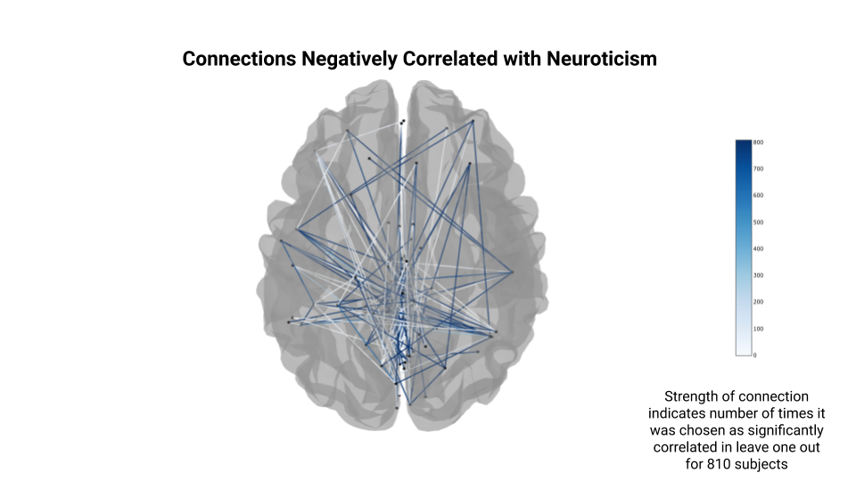

# Predicting Neuroticism and Personality Traits from fMRI Data

JR Bee Illustration
# Project Definition - Week 1
### Background
#### Annabelle
I am a currently doing my master's in computer science at UdeM in the bioinformatics stream. I haven't locked down my thesis project yet but it will involve the impact of rare genetic variants on functional connectivity. I did my undergrad in math and have a pretty good basis in coding in python and machine learning, but I am totally new to neuroscience and very excited about brainhack school.

#### Project
I worked on this project with Liz Izakson. We're interested in variation in human brains and am curious about neuropsychiatric disorders as extremes of characterestics that are found in the overall population. To explore this idea, we want to look at the human connectome project dataset of 1200 healthy young adults that includes resting state fMRI and personality/behaviour data. Specifically, I want to try and predict neuroticism, one of the big five personality traits that is associated with mental disorders, from fMRI to see if:
1. If there are significant/consistent markers for neuroticism in fMRI data.
2. If so, how do they compare to findings about schizophrenia/anxiety/depression/ADHD in the literature.

### Tools
We plan on using the following tools:
 * compute canada servers with globus and aws s3 for file access and transfer
 * nilearn
 * similarity network fusion
 * sklearn
 * Data visualization
 
## Learning Goals
Annabelle - I especially want to use brainhack school to learn to work with fMRI data, explore different parcellation methods and ways to produce features from connectivity matrices. I also want to learn to use compute canada servers, and to improve and explore my coding skills and to learn tools for open science and reproducibility.

### Data
We will use the HCP 1200 healthy young adult dataset.

### Deliverables
I would like to produce jupyter notebooks with examples of the analysis code, an interactive data visualization, and a script for running jobs on compute canada servers.

# Results - Week 4

### Progress overview

We started out working with preprocessed data from the HCP,and explored different ways of using parcellations and connectivity measured to produce connectivity matrices. A lot of time went into learning how to download and use data in this format, but the data is very large and was very challenging to work with. Through reading a lot of papers we eventually discovered that HCP data is much larger than average per subject (about an hour of scan each) and that they have published an even further processed data set of parcellations, time series, and connectivity matrices (PTN release). We decided to switch to this data set which allowed us to work with 810 subjects, which would have been impossible otherwise.

With the PTN data we focussed on predicting Neuroticism from the processed connectivity matrices, I tried a few linear models with leave one out cross validation and found that prediction was pretty terrible and Liz tried to improve on the prediction by using neural nets and tweaking parameters. 

To try different models, I rewrote jupyter notebooks that I used to write and test code as python scripts that could be used more efficiently to make comparisons. In the end we found that neuroticism and personality traits are very hard to predict from fMRI data and that one month is not very long to explore and compare the many many different options for processing fMRI data.

### Tools I learned during this project

 * Nilearn
 * Compute canada
    * Slurm
    * ssh/scp
    * venv
 * Git/github
 * Jupyter lab
 * Scipy
 * Bash
 * t-SNE
 * Monitoring memory/CPU usage and strategies for working with fMRI data on a very weak laptop
    
 
### Results
Here is a summary of predictions of neuroticism using the three models and their respective mean squared error (MSE) values:

Here is an image of the networks that are correlated with neuroticism (note that the predictions are poor and the parcellation done by using group ICA and 200 nodes has no labels so these are more fun visualizations than anything meaningful):

#### Deliverable 1: Jupyter notebooks

 * ptn_pipeline.ipynb - walks through the python scripts and explain the code.
 * data_viz.ipynb - uses the outputs from the python scripts to create figures with seaborn and nilearn plotting, the interactive nilearn plots are saved as .html files in the figures folder of this repo.

#### Deliverable 2: Pyhon scripts

* ptn_script.py - code to run the models and save the output files.
* clean_data.py - code to remove the subjects with no behavioural data from HCP PTN recon2 download (see documentation/how_to.md)

#### Deliverable 3: Documentation
 
* How to download the data from HCP
* Details on how to run the code
* List of packages used - requirements.txt 
 
## Thank you!!
Special thanks to Pierre Bellec, Desiree Lussier, Peer Herholz, Liz Izakson and everyone I got to chat with through clinics and groups! Brainhack school has been an amazing introduction to neuroimaging, I'm very grateful for everyone's time, help, ressources and encouragement!
