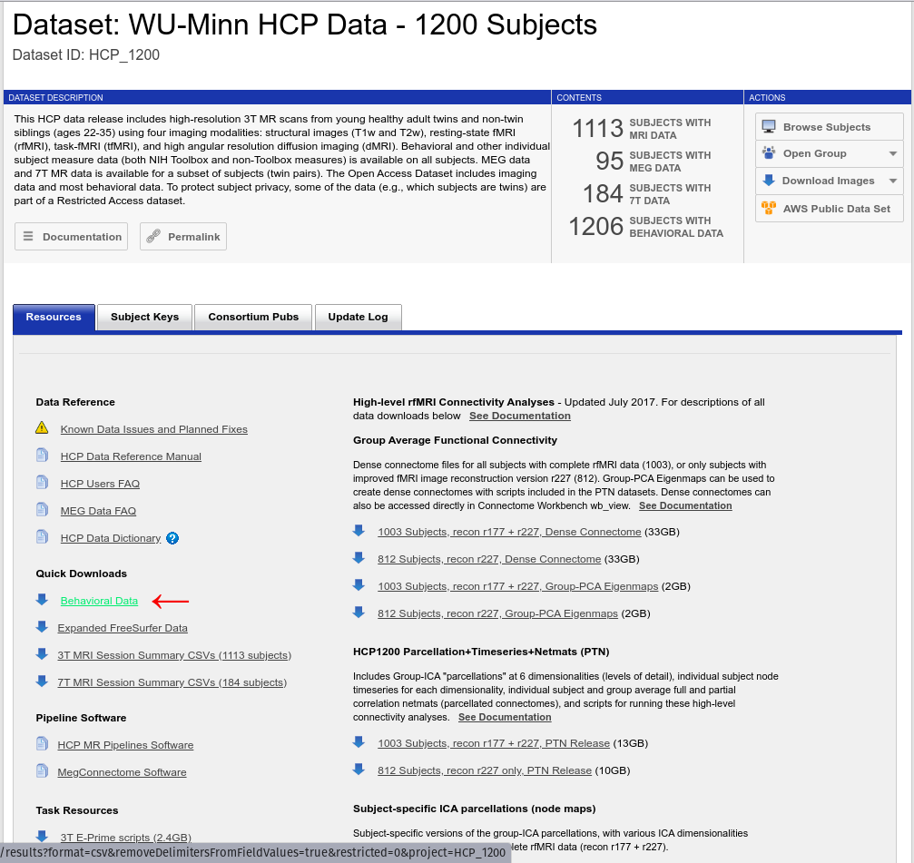

# How To
## 1. Download data from the human connectome project website:

Prior to the download, we registered to [the HCP website](https://db.humanconnectome.org/)
and downloaded Aspera Plugin (it was requested by the website for the download process).

Then, in the main menu we chose the WU-Minn HCP Data -1200 subjects and clicked on “Open Dataset”. On this page, you can download the behavioural data, under "Quick Downloads" click on "Behavioural Data":

The netmats (connectivity matrices) data can be found under "HCP1200 Parcellation+Timeseries+Netmats (PTN)", click on "812 Subjects, recon r227 only, PTN Release":

The data is documented [here](https://www.humanconnectome.org/storage/app/media/documentation/s1200/HCP1200-DenseConnectome+PTN+Appendix-July2017.pdf). The data is provided for several different resolutions of ICA, we used the 200 nodes resultion and netmats2.txt in our analysis since partial correlation has been documented to be better for prediction (Dadi et al. 2019).

## 2. Clean the data:
We need to restrict the behavioural data from all the subjects to the 812 in the recon2 dataset we are using as well as drop 2 subjects in that dataset that don't have behavioural information.
* Run clean_data.py
* It requires the paths to the netmats2.txt file as well as the csv of the full behavioural data.
* It will produce two files:
  * netmats2_clean.txt - the cleaned connectivity matrices
  * all_traits.csv - scores for all 5 personality traits ffor each subject with the data and their subjectIDs
  
Alternatively, all_traits.csv exists in this repo (although you will still need to download the PTN data from HCP) as well as the complete behavioural data from HCP as HCP_behavioural.csv.

## 3. Do some predictions:
If you have the space and time! This is slow on my laptop, and takes about 1gb of memory.
* Run ./run_script_locally.sh in the same directory as the files all_traits.csv and netmats2_clean.txt
* It outputs files in the format NEOFAC_<trait>_<method>_predictions.csv and NEOFAC_<trait>_<method>_MSE.csv
  * Traits are: N - neuroticism, A - agreeableness, O - openness, C - conscientiousness, E - extraversion
  * Methods are: CPM - connectome based predictive modelling, LR - linear regression, SVR - support vector regression
  * Predictions and MSE are returned in a format that is documented in ptn_script.py

